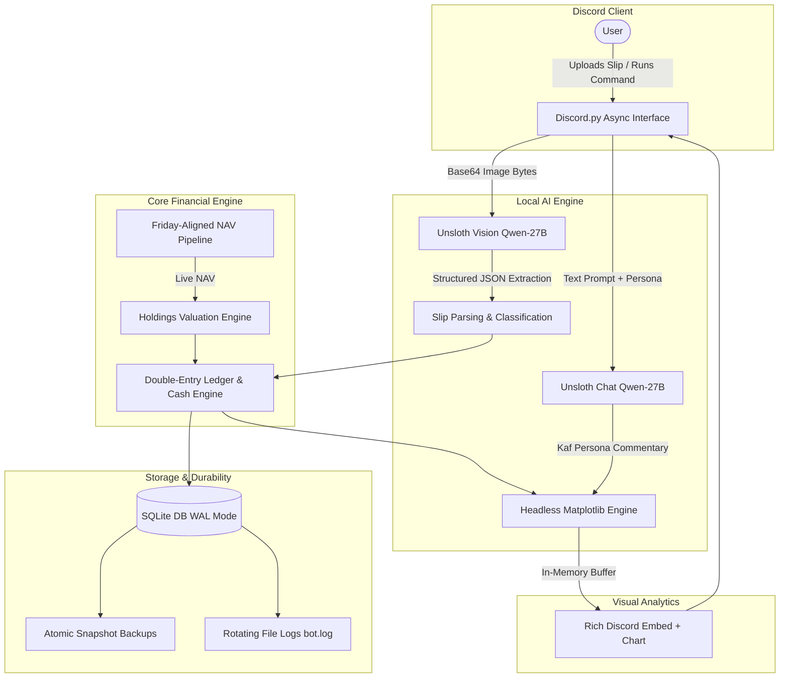
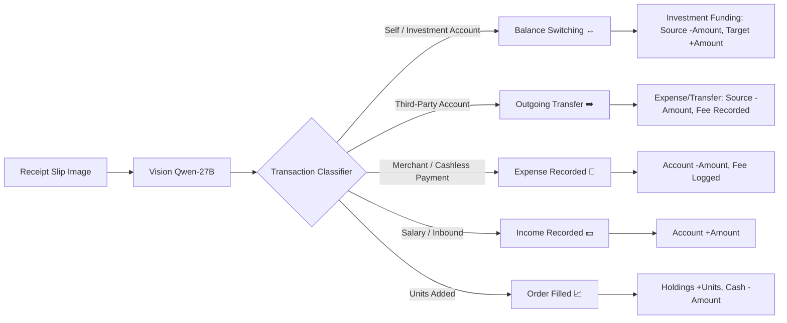

# Kaf (カフ)
# Autonomous Local-First Personal Finance Bot

> *"Allow me to handle your finances, Master. Rest assured, every single cent is meticulously accounted for."*

**Kaf** is an autonomous, privacy-first personal financial accounting bot powered by local AI vision and reasoning. Operating directly within Discord, Kaf transforms unstructured transaction slips into verified double-entry ledger transactions without exposing any financial telemetry or bank credentials to third-party cloud APIs.

---

## 🏛️ Architecture Overview



### Key Architectural Pillars

1. **Local AI Vision & Reasoning (Zero Cloud Exposure)**
   - Powered by a self-hosted inference server running `Qwen-27B` (or quantized GGUF variants) locally.
   - All financial slips, bank account details, transaction notes, and personal receipts are processed strictly on local hardware (NVIDIA/AMD GPU). No data ever leaves your private network.

2. **Discord.py Asynchronous Interface & Rollback Protection**
   - Built on `discord.py` utilizing asynchronous non-blocking event loops (`asyncio.to_thread` for heavy parsing, image rendering, and network operations).
   - High-confidence automated commits with instant single-command rollback protection via `/undo`.

3. **Multi-Account Dual-Currency Ledger**
   - Tracks liquid checking/savings accounts, physical cash reserves, and investment holdings across domestic and foreign currency assets.
   - Accurate proportional valuation converting global equity holdings at prevailing market rates.

4. **Durability & Crash Resilience**
   - **SQLite WAL Mode (`PRAGMA journal_mode=WAL;`)**: Guarantees zero database write-locking during concurrent Discord interactions, crash safety, and high-speed write performance (`synchronous=NORMAL`).
   - **Atomic Snapshot Backups**: In-memory SQLite backup API creates consistent, uncorrupted `.db` snapshots. Features automatic biweekly backups and on-demand `/backup` exports uploaded directly to Discord.

5. **Dynamic NAV & Market Pipeline**
   - Multi-tiered resilient scraping engine.
   - Dynamic network failure fallback dynamically tracks the latest known good NAV.

6. **Visual Analytics & Personality Commentary**
   - Headless Matplotlib engine (`matplotlib.use('Agg')`) rendering dark-theme (`#1e1f22`) donut charts and horizontal bar charts directly into in-memory `io.BytesIO` buffers.
   - Generates Kaf's personality-driven commentary and financial reviews based on dynamic persona prompts loaded from `persona.md`.

---

## ⚡ Slash Commands

| Command | Arguments | Description |
| :--- | :--- | :--- |
| `/checkbalance` | *None* | Displays complete net worth breakdown across liquid banks and investment holdings. |
| `/checkactivity` | `days` *(optional, default: 7)* | Summarizes recent outflows, me-to-me transfers, and balance switches with category icons. |
| `/checkincome` | *None* | Lists incoming deposits and wallet inflows over the last 7 days. |
| `/cashin` | `amount` *(IDR)*, `note` | Records cash inflow directly into your physical wallet. |
| `/cashout` | `amount` *(IDR)*, `note` | Records cash outflow from your physical wallet. |
| `/undo` | *None* | Reverts the most recently recorded transaction, restoring balances and reversing ledger changes. |
| `/chart portfolio` | *None* | Renders a dark-themed donut chart of asset allocation with Kaf's custom commentary. |
| `/chart expenses` | `days` *(optional, default: 30)* | Generates a horizontal bar chart of categorized expenses with formatted IDR totals. |
| `/backup` | *None* | Creates an atomic, uncorrupted SQLite snapshot and uploads the `.db` file to Discord. |

---

## 🧾 Receipt Vision & Classification Flow

When an image attachment is uploaded to any channel accessible by the bot, Kaf automatically executes the following extraction pipeline:



- **Balance Switching (↔️)**: Transfers between user's personal accounts or Investment deposit. Updates both balances without falsely inflating expense statistics.
- **Outgoing Transfers (➡️)**: Transfers sent to external recipients. Deducts transfer amount and any associated admin fees (e.g., BI-FAST Rp 2,500).
- **Merchant Expenses (💸)**: Purchases, restaurants, fuel, groceries, and cashless payments. Automatically categorized.
- **Order Execution (📈)**: Mutual fund/ETF purchases or stock trades. Adds ticker units to `holdings` and deducts cash from the investment balance.

---

## 🛠️ Local Setup & Installation

### Prerequisites

1. **Python 3.10+**: Standard Python installation with `pip` and virtual environment support.
2. **GPU & Local LLM Host**:
   - AMD (ROCm) or NVIDIA (CUDA) GPU with at least 16GB VRAM.
   - vLLM running a multimodal model (e.g. `Qwen/Qwen2.5-VL-7B-Instruct` or `Qwen2.5-32B-Instruct` via OpenAI-compatible endpoints) locally on port `8000`.
3. **Discord Bot Application**:
   - A Discord bot token created from the [Discord Developer Portal](https://discord.com/developers/applications).
   - Bot permissions: `Send Messages`, `Attach Files`, `Embed Links`, `Read Message History`.
   - Privileged Gateway Intent: **Message Content Intent** enabled.

---

### Installation Steps

1. **Clone the repository**:
   ```bash
   git clone https://github.com/Gen-Hildolfr/Kaf.git
   cd Kaf
   ```

2. **Set up virtual environment & install dependencies**:
   ```bash
   python -m venv venv
   # On Windows:
   .\venv\Scripts\activate
   # On Linux/macOS:
   source venv/bin/activate

   pip install -r requirements.txt
   ```
   *(Ensure `discord.py`, `yfinance`, `requests`, `python-dotenv`, and `matplotlib` are installed).*

3. **Configure Environment Variables (`.env`)**:
   Create a `.env` file in the project root based on the following template:
   ```env
   # Discord Configuration
   DISCORD_TOKEN=your_discord_bot_token_here

   # Local AI Endpoint
   LOCAL_AI_API_URL=http://localhost:8000/v1/chat/completions
   LOCAL_AI_API_KEY=
   LOCAL_AI_MODEL=ukisai/Swift-Qwen3.8-27B-GGUF

   # Personal Identity & Tracked Bank Details
   USER_NAME=YOUR_LEGAL_NAME
   BANK_ACCOUNT_NO=BANK_ACCOUNT_NUMBER
   ```

4. **Verify Persona (`persona.md`)**:
   Ensure `persona.md` is present in the project root to enable Kaf's personality-driven commentaries.

---

## 🧪 Isolated Smoke Test Suite

Kaf includes an isolated test runner that validates all core features against a temporary database (`test_finance.db`) without touching your real ledger:

```bash
python kaf.py --test
```

The test suite validates:
- **Part 0**: Dynamic money market NAV scraping, multi-endpoint fallback, and Friday-aligned market cache verification.
- **Part A**: Physical cash flow accounting (`record_cash_flow`).
- **Part B**: Internal account switching, investment RDN deposit routing, and trade order execution.
- **Part C**: Transaction rollback via `/undo` restoring exact ledger states.
- **Part D**: Matplotlib dark-theme chart generation (donut and bar chart buffers) and figure cleanup.
- **Part E**: SQLite backup API consistency and biweekly schedule evaluation.
- **Part F**: Rotating file logger writes and file handle durability.

---

## 🚀 Running the Bot

To start Kaf in production:

```bash
python kaf.py
```

All operational logs will stream to `stdout` and automatically rotate into `bot.log` (up to 5MB per file with 3 historical archives).
